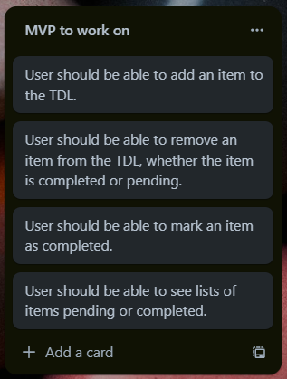

# TDL v1 

TDL is a simple to-do-list that allows users to add/remove tasks as well as indicate that a task has been completed.

## Preparation

### User Story

### Wireframe

## Thoughts

- Still not clear as to when I should use 'onClick={function}' or 'onClick={() => {function}}. 
- Learned that I can manipulate values within objects using destructuring. 

## Future Development

- I will use mobile-first approach. 
- This project was created with Vite. Next time, I will use Next.js and use routing. 